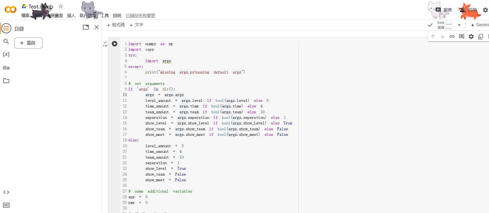
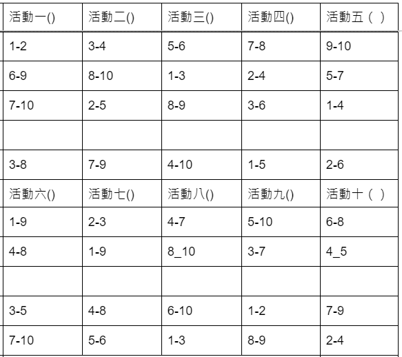

# 前言
這是我使用python隨手寫的小程式，可以用來生成像是大地遊戲這種活動的跑關表
(相信各位也覺得這部份很麻煩，我幫你們寫完了，很棒吧)
此程式可以指定「隊伍數量」、「時間分段」，每個時間段的「關卡數」、「跑關次數」，後續會說明

程式預設每個時間段同一小隊不可重複造訪同一關卡，並且盡可能不遇到其他已經遇過的小隊

最後，這是我第一次寫README，所以寫得很爛請見諒
而且這個程式真的是隨手寫的，所以模組化甚麼的都沒有管，可以跑就好
## 給非程式背景的人
使用Google搜尋「Google Colab」，把`generate.py`中的程式碼全部複製，丟進Colab裡面，執行，就可以跑了

不用管`args.py`沒關係

畫面大概長這樣



# 控制項
可以在cmd以以下方式傳入參數
```bash!
python generate.py --team 10 --seperation 2 --level 5 --time 4
```
上方的cmd大致代表著：



## 參數控制項
- `--team` 隊伍數量
- `--seperation` 時間分段
- `--level` 關卡數
- `--time` 跑關次數

由於此程式是使用dfs(暴力破解)寫成，請自行評估參數的可行性，否則會跑超久跑不出來

或是可以參考後續的解決方法

## 輸出控制項
- `--show_level` 顯示關卡表 (預設為True)
    <details>
        ```
        ----------------------------------------
        Time Table for Levels: 
        [(1, 2), (3, 4), (5, 6), (7, 8), (9, 10)]
        [(6, 9), (8, 10), (1, 3), (2, 4), (5, 7)]
        [(7, 10), (2, 5), (8, 9), (3, 6), (1, 4)]
        [(3, 8), (7, 9), (4, 10), (1, 5), (2, 6)]
        ```    
    </details>
    
- `--show_team` 顯示隊伍表 (預設為False)
    :::spoiler 輸出範例
    ```
    ----------------------------------------
    Time Table for Teams:
    Team  1:  1->3->5->4->ED
    Team  2:  1->4->2->5->ED
    Team  3:  2->3->4->1->ED
    Team  4:  2->4->5->3->ED
    Team  5:  3->5->2->4->ED
    Team  6:  3->1->4->5->ED
    Team  7:  4->5->1->2->ED
    Team  8:  4->2->3->1->ED
    Team  9:  5->1->3->2->ED
    Team 10:  5->2->1->3->ED
    ```
    :::
- `--show_meet` 顯示小隊相遇次數 (預設為False)
    :::spoiler 輸出範例
    ```
    ----------------------------------------
    Meet Table:
    [[0 1 1 1 1 0 0 1 0 0]
     [1 0 0 1 1 1 0 0 0 0]
     [1 0 0 1 0 1 1 1 1 1]
     [1 1 1 0 0 1 0 0 1 1]
     [1 1 0 0 0 1 1 0 0 0]
     [0 1 1 1 1 0 0 0 1 1]
     [0 0 1 0 1 0 0 1 1 1]
     [1 0 1 0 0 0 1 0 1 1]
     [0 0 1 1 0 1 1 1 0 1]
     [0 0 1 1 0 1 1 1 1 0]]
    ```
    :::

# 相遇次數的Threshold
雖然每個小隊最多相遇一次是最理想的情況，但有時就是沒辦法

因此在`generate.py`中第34行可以設定每個小隊最多相遇的次數
也可以再進一步調整threshold的行為

預設為：
```python!
threshold = 0 if sep==0 or ind<team_amount*time_amount/4 else 1
```
